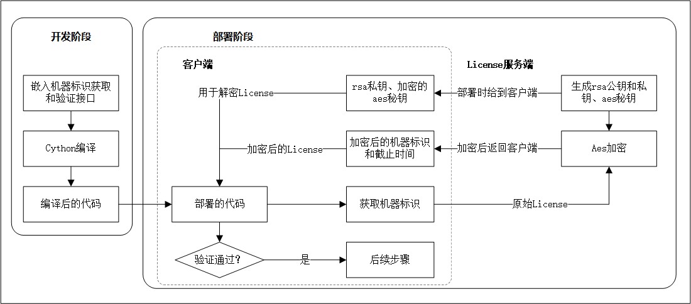

# Python 项目加密部署及License生成和验证

---
#### 概要

旨在为基于python开发的各类工具、服务端的简单部署提供解决方案

**注：** 不适用于大型项目、商用部署

具有保护源码、防止复制、时间控制等功能，可以用于各种操作系统及基于docker的部署环境

- **保护代码：** 通过Cython编译为pyd或so文件
- **防止复制：** 获取和验证机器的唯一标识
- **时间控制：** 在License中加入失效时间

---
#### 使用

#### 环境

```shell
pip install pycryptodome Cython pyinstaller
```
**注：** Cython仅用于编译

#### 结构和功能

**./server** 秘钥管理
- assets : ui界面资源
- data : 储存生成的秘钥文件
- func.py : 生成秘钥和加密License
- gui.py : ui界面
- main.py : ui界面入口

使用时直接运行：
```shell
python main.py
```

**./client** 集成部署在客户端
- license_getter.py : 获取机器标识，生成License
- license_verifier.py : 验证License
- main.py : 调用示例

#### 编译和集成
集成时，main.py中的调用过程必须编译，且对关键函数重命名或重写

**./build** 用于编译python源码，使用时先修改main.py中的待编译文件列表
```shell
cd ./build

python setup.py build_ext --inplace
```

- .py python的源代码文件编译后生成的字节码 .pyc Python源代码import后
- .pyd Python的动态链接库(Windows平台dll)
- 以pyc 为扩展名的是Python的编译文件。其执行速度快于 py 文件且不能用文本编辑编辑查看
所以 pyc 文件往往代替 py 文件发布。虽然pyc文件加载的速度很快，但很容易被反编译
pyw也不行，只是隐藏命令行界面而已，可以作为入口脚本。pyo和pyc差不多，也容易被反编译
- pyd格式是D语言(C/C++综合进化版本)生成的二进制文件，实际也就是dll文件
- 该文件目前位置没找到可以被反编译的消息，只能被反汇编。Sublime text编辑器也是使用该格式
- **在python 运行时先寻找调用 .pyd文件, 如果找不到再寻找相对应的.py文件**

#### pyinstaller 打包为.exe 
首先需要安装 pyinstaller
```shell
pip install pycryptodome Cython pyinstaller
```
然后执行打包,
不需要编译 为pyc 或者 pyd， 打包自动把  py 文件编译为 pyd
```shell
pyinstaller -w -D --add-data "assets/;assets/"  --icon=.\icon.ico --clean -y main.py
```
参数说明：
- -w  Windows 和 Mac OS X：不提供标准 I/O 的控制台窗口。
- -D --onedir  Create a one-folder bundle containing an executable (default) 
- --clean Clean PyInstaller cache and remove temporary files before building.
- --add-data <SRC;DEST or SRC:DEST>    要添加到可执行文件的其他非二进制文件或文件夹。路径分隔符是特定于平台的，使用 os.pathsep （在 Windows 上为 ; 在大多数 UNIX 系统上为 :）。该选项可以多次使用。
- -y, --noconfirm    替换输出目录（默认：SPECPATH/dist/SPECNAME）而不要求确认
- -i 设置图标
命令执行结果;
- 生成 main.spec 可以使用, 避免下次輸入更多命令
- dist/main 目录就是打包好的程序文件, main.exe 点击可执行
- 
```shell
pyinstaller main.spec -y
```


#### 集成示例

以一个简单的flask项目为例

在app.py中，定义app启动函数，在未检测到License文件时，调用get_license获取机器标识，在检测到有License时，调用is_license_valid判断License是否有效：

```python
from license_verifier import is_license_valid
from license_getter import get_license

def app_run():
    if not os.path.exists(lic_file):
        get_license(lic_file)
        print('License is generated')
        return
    if is_license_valid(lic_file=lic_file, aes_key_file=aes_key, rsa_key_file=rsa_key):
        app.run(host=host, port=port, threaded=True)
    else:
        print('License is invalid')
        return
```
**注：** 如前文，实际情况下先将关键函数重命名或重写，提高安全性

部署时，编译app.py, license_getter.py, license_verifier.py，设置manage.py作为启动入口

```python
from app import app_run

if __name__ == '__main__':
    app_run()
```

---
#### 具体实现


原理非常简单，如上图所示


